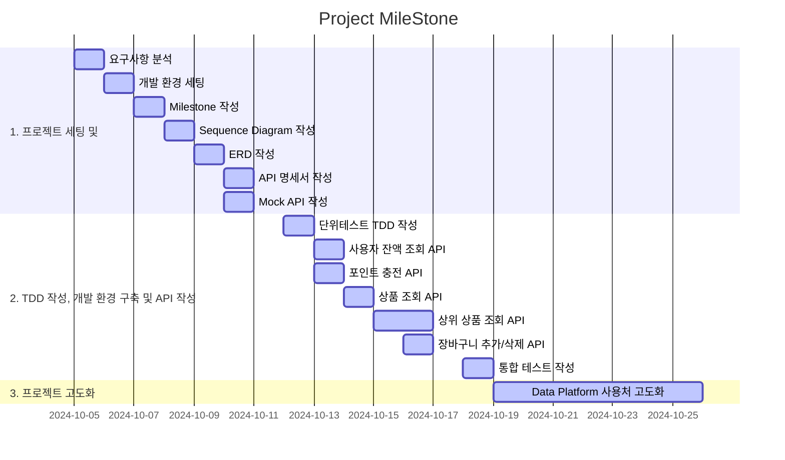

```mermaid
gantt
    title Project MileStone
    dateFormat  YYYY-MM-DD
    section 1. 프로젝트 세팅 및
        요구사항 분석            :active, a1, 2024-10-05, 1d
        개발 환경 세팅         :active, a1, 2024-10-06, 1d
        Milestone 작성         :active, a1, 2024-10-07, 1d
        Sequence Diagram 작성  :active, a1, 2024-10-08, 1d
        ERD 작성               :active, a1, 2024-10-09, 1d
        API 명세서 작성        :active, a1, 2024-10-10, 1d
        Mock API 작성          :active, a1, 2024-10-10, 1d

    section 2. TDD 작성, 개발 환경 구축 및 API 작성
        단위테스트 TDD 작성     :active, b1, 2024-10-12, 1d
        사용자 잔액 조회 API    :active, b2, 2024-10-13, 1d
        포인트 충전 API :active, b3, 2024-10-13, 1d
        상품 조회 API   :active, b4, 2024-10-14, 1d
        상위 상품 조회 API        :active, b5, 2024-10-15, 2d
        장바구니 추가/삭제 API       :active, b6, 2024-10-16, 1d
        통합 테스트 작성       :active, b7, 2024-10-18, 1d
        
    section 3. 프로젝트 고도화
        Data Platform 사용처 고도화     :active, c1, 2024-10-19, 7d
```