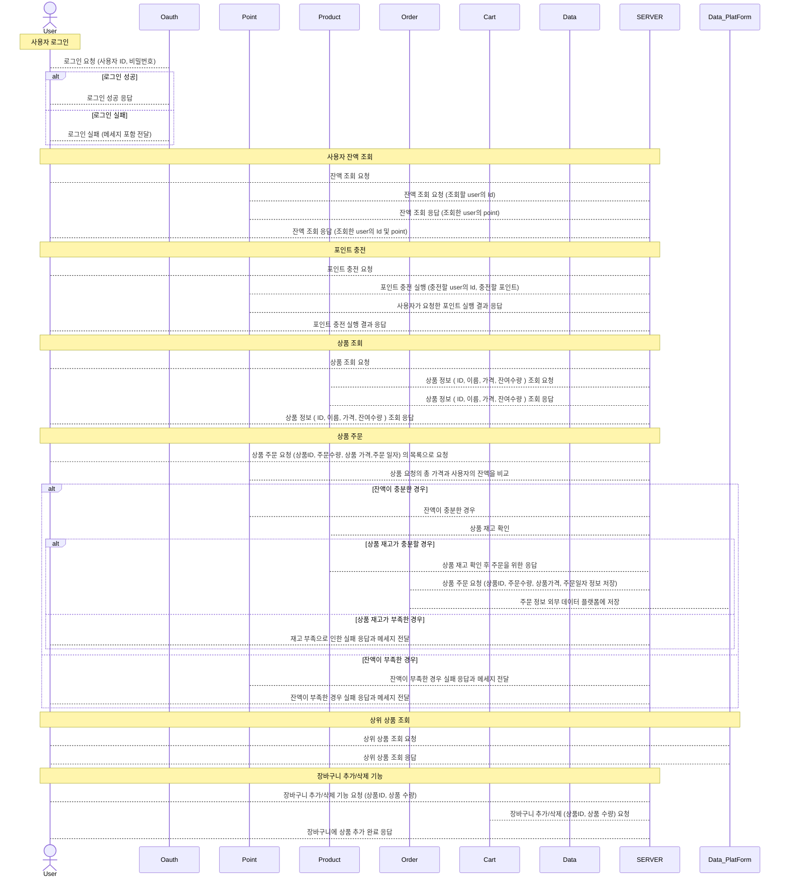

```mermaid
sequenceDiagram
    actor  User
    participant Oauth
    participant Point
    participant Product
    participant Order
    participant Cart
    participant Data
    
    %% 1.사용자 로그인
    Note over User: 사용자 로그인
    User --> Oauth: 로그인 요청 (사용자 ID, 비밀번호)
    alt 로그인 성공
        Oauth --> User: 로그인 성공 응답
    else 로그인 실패
        Oauth --> User: 로그인 실패 (메세지 포함 전달)
    end
    
    %% 2.사용자 잔액 조회
    Note over User, SERVER: 사용자 잔액 조회
    User --> SERVER : 잔액 조회 요청
    SERVER --> Point : 잔액 조회 요청 (조회할 user의 Id)
    Point --> SERVER : 잔액 조회 응답 (조회한 user의 point) 
    SERVER --> User : 잔액 조회 응답 (조회한 user의 Id 및 point)
    
    %% 3.포인트 충전
    Note over User, SERVER: 포인트 충전
    User --> SERVER : 포인트 충전 요청
    SERVER --> Point : 포인트 충전 실행 (충전할 user의 Id, 충전할 포인트)
    Point --> SERVER : 사용자가 요청한 포인트 실행 결과 응답
    SERVER --> User : 포인트 충전 실행 결과 응답
    
    %% 4.상품 조회
    Note over User, SERVER: 상품 조회
    User --> SERVER : 상품 조회 요청
    SERVER --> Product : 상품 정보 ( ID, 이름, 가격, 잔여수량 ) 조회 요청
    Product --> SERVER : 상품 정보 ( ID, 이름, 가격, 잔여수량 ) 조회 응답
    SERVER --> User : 상품 정보 ( ID, 이름, 가격, 잔여수량 ) 조회 응답  
    
    %% 5.상품 주문
    Note over User, SERVER: 상품 주문
    User --> SERVER : 상품 주문 요청 (상품ID, 주문수량, 상품 가격,주문 일자) 의 목록으로 요청
    SERVER --> Point : 상품 요청의 총 가격과 사용자의 잔액을 비교
    alt 잔액이 충분한 경우
        Point --> SERVER : 잔액이 충분한 경우
        SERVER --> Product : 상품 재고 확인
        alt 상품 재고가 충분할 경우
        Product --> SERVER : 상품 재고 확인 후 주문을 위한 응답
        SERVER --> Order : 상품 주문 요청 (상품ID, 주문수량, 상품가격, 주문일자 정보 저장)
        Order --> Data_PlatForm : 주문 정보 외부 데이터 플랫폼에 저장
        else 상품 재고가 부족한 경우 
        SERVER --> User : 재고 부족으로 인한 실패 응답과 메세지 전달
        end
    else 잔액이 부족한 경우
        Point --> SERVER : 잔액이 부족한 경우 실패 응답과 메세지 전달
        SERVER --> User : 잔액이 부족한 경우 실패 응답과 메세지 전달
    end
    
    %% 6.상위 상품 조회
    Note over User, Data_PlatForm: 상위 상품 조회
    User --> Data_PlatForm : 상위 상품 조회 요청
    Data_PlatForm --> User : 상위 상품 조회 응답
    %%  좀더 생각좀....
    
    %% 7.장바구니 추가/삭제 기능
    Note over User, SERVER: 장바구니 추가/삭제 기능
    User --> SERVER : 장바구니 추가/삭제 기능 요청 (상품ID, 상품 수량)
    SERVER --> Cart : 장바구니 추가/삭제 (상품ID, 상품 수량) 요청
    SERVER --> User : 장바구니에 상품 추가 완료 응답
```