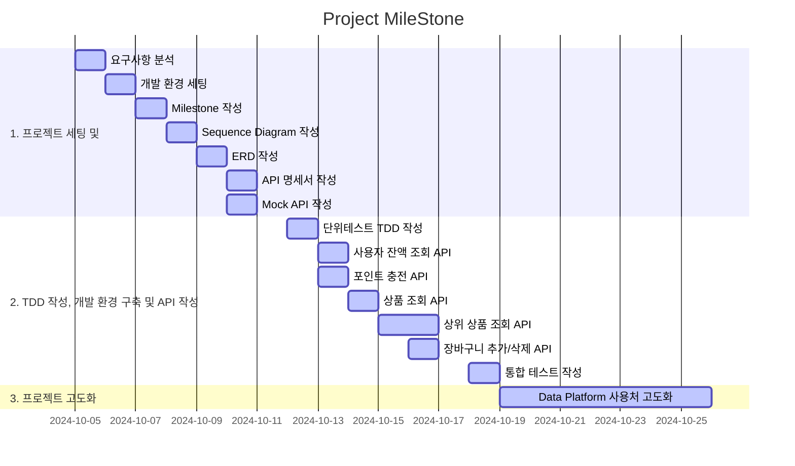
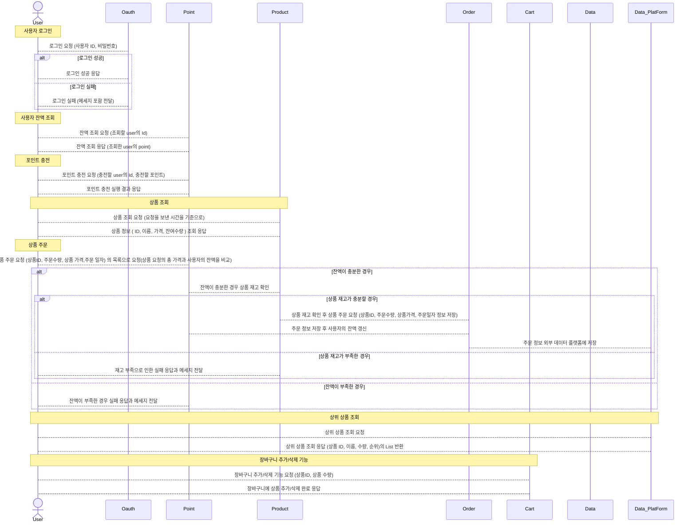
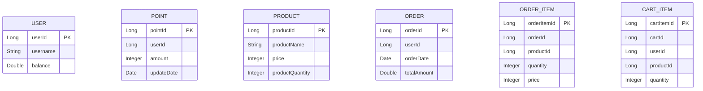

#
시나리오는 이커머스 프로젝트를 선정하였스며

MileStone 의 구조는 다음과 같습니다.

3주간의 일정을 어느정도 작성했으며

해당 프로젝트를 설계하며 작성한 Sequence Diagram은 다음과 같습니다.
(파일별로도 분류를 해두었습니다)

ERD는 다음과 같습니다.
연관관계를 피하기 위해 다음과 같이 설계하였습니다.

우선적으로 패키지 구조는

├── application
│ └── dto
│     ├── CartRequest.java
│     ├── OrderItemDTO.java
│     ├── OrderRequest.java
│     ├── PointChargeRequest.java
│     └── ProductDto.java
├── controller
│ ├── CartController.java
│ ├── OrderController.java
│ ├── ProductController.java
│ └── UserController.java
├── domain
├── infrastructure
└── structure.txt

형식으로 잡게되어 있습니다.
Split by Layer, Package by Feature 원칙으로 패키지를 구성하여 채워나갈 예정입니다.

기술 스택은 다음과 같습니다.
- Spring Boot
- JPA
- MYSQL(사용 예정)
- Gradle
- Junit5
- Mockito
- Swagger
- Kafka(사용 예정)