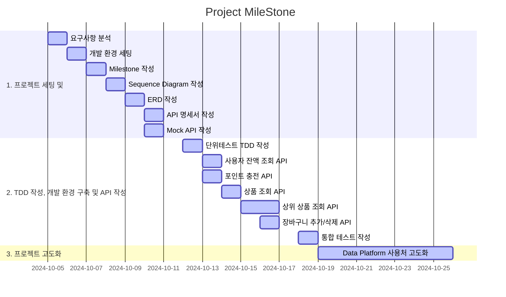
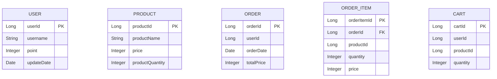

#
시나리오는 이커머스 프로젝트를 선정하였스며

MileStone 의 구조는 다음과 같습니다.

3주간의 일정을 어느정도 작성했으며

해당 프로젝트를 설계하며 작성한 Sequence Diagram은 다음과 같습니다.
(파일별로도 분류를 해두었습니다)

##
- [상품 주문](docs/OrderDiagram.md)
- [포인트 충전](docs/PointChargeDiagram.md)
- [사용자 잔액 조회](docs/PointCheckDiagram.md)
- [상위 상품 조회](docs/RankingDiagram.md)
- [장바구니 추가/삭제](docs/CartDiagram.md)
- [상품 조회](docs/ProductDiagram.md)

ERD는 다음과 같습니다.

우선적으로 패키지 구조는

Split by Layer, Package by Feature 원칙으로 패키지를 구성하여 채워나갈 예정입니다.

기술 스택은 다음과 같습니다.
- Spring Boot
- JPA
- MYSQL
- Gradle
- Junit5
- Mockito
- REDIS
- Swagger
- Kafka(사용 예정)

Swagger 사용관련 문서입니다.
- [Swagger](docs/Swagger.md)

Cache 사용으로 성능 개선 보고서입니다.
- [Cache 사용](docs/report.md)

인덱스 적용 및 분석 보고서입니다.
-[인덱스 적용 및 분석](docs/indexReport.md)

트랜잭션 분리에 관한 설계서입니다.
-[트랜잭션 분리](docs/TransactionReport.md)