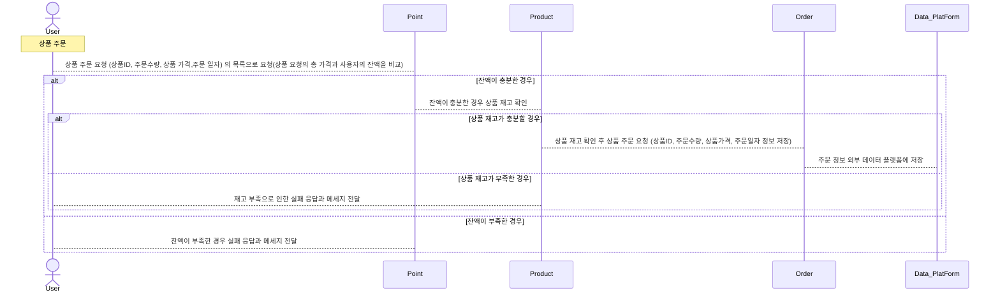

```mermaid
sequenceDiagram
    actor  User

%% 5.상품 주문
Note over User: 상품 주문
User --> Point : 상품 주문 요청 (상품ID, 주문수량, 상품 가격,주문 일자) 의 목록으로 요청(상품 요청의 총 가격과 사용자의 잔액을 비교)
alt 잔액이 충분한 경우
Point --> Product : 잔액이 충분한 경우 상품 재고 확인
alt 상품 재고가 충분할 경우
Product --> Order : 상품 재고 확인 후 상품 주문 요청 (상품ID, 주문수량, 상품가격, 주문일자 정보 저장)
Order --> Data_PlatForm : 주문 정보 외부 데이터 플랫폼에 저장
else 상품 재고가 부족한 경우
Product --> User : 재고 부족으로 인한 실패 응답과 메세지 전달
end
else 잔액이 부족한 경우
Point --> User : 잔액이 부족한 경우 실패 응답과 메세지 전달
end

```