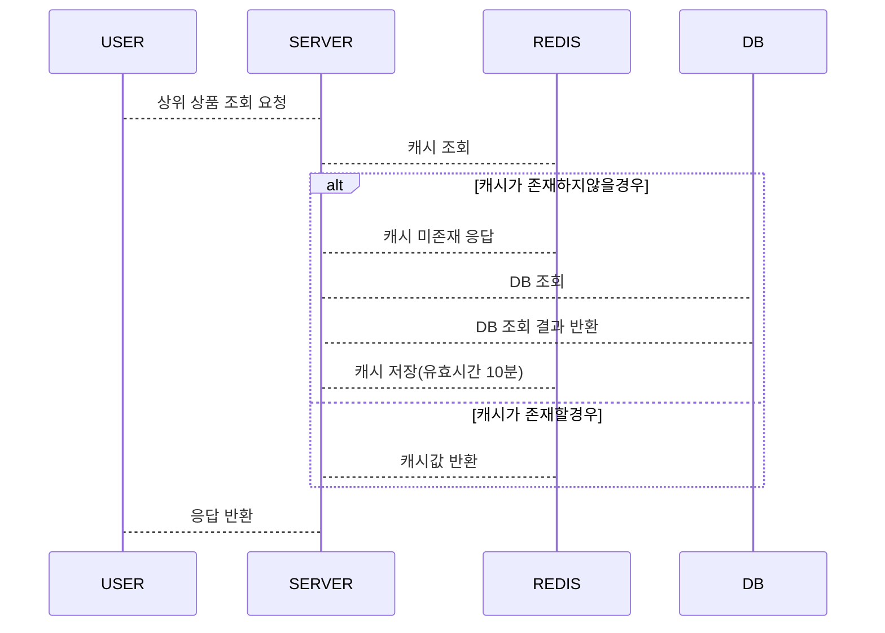

# Caching 적용을 통한 성능개선

### 1. 성능개선할 로직과 선택 이유

상품 조회 API 와 상위 상품 조회 API 두가지의 API는
현재 구현된 다른 API 들보다 사용 빈도가 높다 생각이들었습니다.
<br>
그 이유로는 사용자의 입장에서 특별한 액션을 안해도 사용되는 API라고
생각했기 때문입니다. 
<br>
이번 스텝에서는 상위 상품 조회 API를 선택하게되었는데 일반 상품조회 API 보다는 상위상품 조회의 경우가 좀더 사용자에게 빈번하게 이용될거라 예상이 되어 선택하였습니다. 쿠팡, 무신사 등 대규모 이커머스에서 메인페이지만 접속해도 추천 상품, 상품 랭킹 정보가 보이는걸 떠올려 좀더 적합하다 판단하였습니다.

### 2. 성능개선을 위한 분석

현재 상위 상품 조회 API는 다음과 같은 로직으로 구성되어 있습니다.

```java 
    public List<TopOrderProduct> getTopOrderProduct() {
        LocalDateTime endDate = LocalDateTime.now();
        LocalDateTime startDate = endDate.minusDays(3);
        List<TopOrderProduct> topOrderProducts = orderItemRepository.findTopOrderProduct(startDate, endDate);
        return topOrderProducts;
    }

//orderItemRepository 의 조회 쿼리
@Query("SELECT new com.hhplus.ecommerce.application.dto.TopOrderProduct(p.productId, p.productName, SUM(oi.quantity)) " +
              "FROM OrderItem oi JOIN Product p ON oi.productId = p.productId " +
              "WHERE oi.orderDate BETWEEN :startDate AND :endDate " +
              "GROUP BY oi.productId, p.productName " +
              "ORDER BY SUM(oi.quantity) DESC")
List<TopOrderProduct> findTopOrderProduct(@Param("startDate") LocalDateTime startDate, @Param("endDate") LocalDateTime endDate);
```
현재는 해당 쿼리문을 API 호출시 마다 실행하고 있습니다. 이로인해 매번 DB에 접근하여 데이터를 조회하고 있습니다.

### 3. 어떻게 성능개선을 할것인가?

상위 상품 조회 API를 성능개선하기 위해 이번 스텝에서는 캐싱을 적용하고자 합니다.

Redis를 이용하여 캐싱을 적용하려 할 것이고 사용된 캐싱 갱신 정책은 Write Around 방식을 사용하려고 합니다.

why? 상위 상품을 현재 판매량 기준으로 나열을 해두었는데 해당데이터들은
주문을 통해 변동되는 데이터들 입니다.그래서 주문시에는 데이터베이스만 Write 를 진행하고
상위 상품 조회를 할 때 캐시를 읽어오게 할 예정입니다.

소스코드를 적용하였을 때 이렇게 진행하였습니다
```java
    public List<TopOrderProduct> getTopOrderProduct() {
        // 캐시에서 조회
        Object data = redisTemplate.opsForValue().get(TOP_ORDER_PRODUCT_CACHE_KEY);
        // 캐시에 데이터가 있으면 반환
        if (data != null) {
            ObjectMapper objectMapper = new ObjectMapper();
            return objectMapper.convertValue(data, new TypeReference<List<TopOrderProduct>>() {
            });
        }
        // 지금시간으로 부터 3일전까지의 데이터를 조회 (DB)
        LocalDateTime endDate = LocalDateTime.now();
        LocalDateTime startDate = endDate.minusDays(3);
        List<TopOrderProduct> topOrderProducts = orderItemRepository.findTopOrderProduct(startDate, endDate);
        // 캐시에 저장
        redisTemplate.opsForValue().set(TOP_ORDER_PRODUCT_CACHE_KEY, topOrderProducts, 600, TimeUnit.SECONDS);
        return topOrderProducts;
    }
```

### 4. 고민했던 점

Write / Around 방식으로 적용을 하려했는데
캐싱 데이터를 read 할때마다 업데이트를 하면 굉장히 빈번하게 db read가 발생할 것이라 생각이 들었습니다.
그래서 '주문이 자주 일어나서 순위가 변동할수도 있다' 라는 가정하에
캐싱데이터의 만료기간을 10분으로 설정하였습니다.

### 5. 어떻게 구현할 것인가?



시퀀스 다이어그램을 통해 간단히 구현방법을 그려보았습니다.

### 6. 테스트 결과

테스트는 Jmeter를 이용하여 진행하였고 , 테스트 환경은 이렇게 설정하였습니다
사용자(스레드) 수 : 4000
Ram-Up 시간 : 10초

10초간 4000명이 메인페이지에 접근(상위 상품 조회 API를 호출) 하는시나리오를 테스트하였습니다.

### Summary Report
AS-IS (DB 조회) 

TO-BE (redis 캐싱 적용)

해당 이미지들로 비교하였을 때
평균속도 측면에서 꽤 많은 차이가 나는것을 확인할 수 있습니다.

### Trasaction Per Second (TPS) 비교

AS-IS

TO-BE


TPS 그래프를 비교하였을때 같은 양을 감당하였을때
캐싱을 적용한 부분이 좀더 고르게 분포된 점을 확인할수있습니다.

### 7. 결론

상위상품 조회 API 같이 사용자가 자주 이용하면서, 과부화를 일으킬 수 있는 부분에 대해
캐싱을 redis 라는 메모리를 이용해서 적용하였습니다.
DB 의 과부화를 줄이고, 사용자에게 빠른 응답을 제공할 수 있게 된 것 같습니다.

### 8. 앞으로 더 개선해야할 점

Jmeter 를 통해서 테스트를 하면서 이런 현상을 확인할 수 있었습니다.
캐쉬가 처음 존재 하지 않을때, 캐쉬데이터가 없어서 DB 를 조회하는 건수가
71건이 발생되었습니다. 추후로 이런 현상을 방지하기 위해
캐쉬가 만료되기전에 새로운 캐쉬를 생성하는 방식을 고려해봐야할 것 같습니다.
